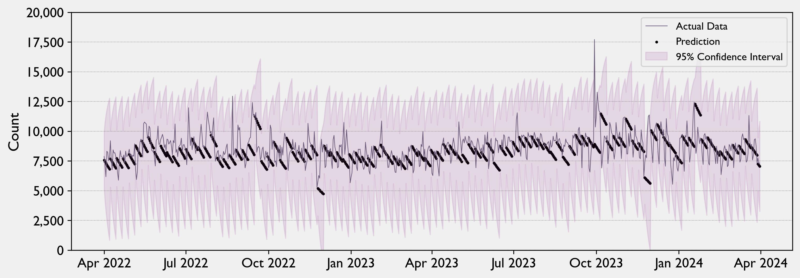
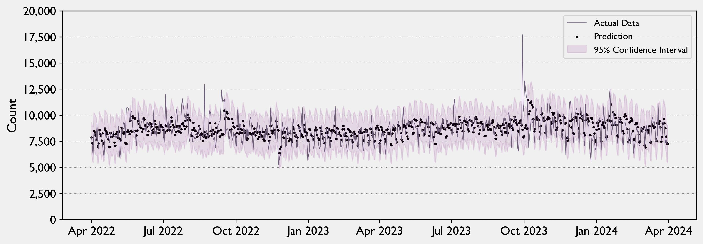

# Forecasting Usage of NYC's 311 Service

Since 2003, New York City has maintained the 311 service, a hub that connects residents to city agencies and provide them with quick and easy access to local government.  It is available 24 hours a day, 7 days a week, 365 days a year, providing assistance in 175 languages and to the hearing-impaired.  In 2023, residents used the 311 service 3.2 million times.  It has become the first stop for residents for a whole host of services, including:

- To secure official documents, such as business, pet or marriage licenses
- To report a pothole or request street resurfacing
- To stay up-to-date on public school calendars, including snow days
- To inform city agencies about quality of life concerns such as noise or litter
- To request maintenance for city-owned apartments and buildings
- To make payments towards property taxes, parking tickets, or other city assessments

*[Image source](https://www.flickr.com/photos/nycstreets/25527414131): Used under CC BY-NC-ND 2.0*

While the cost to the city is not large ($68 million out of a $107 annual billion budget, or less than 0.1%) the value it provides to residents and government officials is considerably larger.  Prior to its advent, the city maintained over 40 separate hotlines and call centers for non-emergency resident services, often with overlapping responsibilities.  As a result of having so many entry points to the city, residents often were confused regarding the right way to contact the City.  Very often, residents chose to call the NYPD or 911, even for non-criminal or non-emergency purposes.  By creating such a recognizable and easy-to-remember portal, the City relieved its agencies of this burden and has been able to more effectively address residents' concerns.

Since inception, the service has continued to expand its usefulness and connectivity.  It maintains a significant social media presence, and in 2013 introduced the 311 App to answer questions or allow service request submissions while avoid lengthening call queues.  However, the service is still in very high demand.  The City Council recently passed a bill to require virtual queues with estimated wait times for callers, and more legislation is queuing up:

Given the consistent demand for and high expectations of the service, anticipating requests would enable the City to meet its citizens needs on a timely basis.  <ins><b>Successful forecasting of next-day, next-week and next-month volumes</b></ins> would lead to residents who are more satisfied with the responsiveness of their local government.  

### Data Sources
**NYC Open Data**: Under the Open Data Law, all New York City agencies are required to make their datasets publicly available on a public portal.  Prior to the creation of the portal, city agencies were required to provide information upon request through New York State's Freedom of Information Law.  However, this method of retrieving information was cumbersome for the requestor and often ineffective, as requests would be submitted ad hoc to a bureaucracy that was not structured to handle them.  The law required city agencies to proactively gather and make available their datasets to the public at large.  The [311 Service Requests](https://data.cityofnewyork.us/Social-Services/311-Service-Requests-from-2010-to-Present/erm2-nwe9/about_data) data set has been available since 2011 and now has over 36 million records included with 41 features.

**Open Meteo**: Daily weather data for New York City was sourced from Open Meteo's public API.  Open Meteo utilizes open data from various national weather services and permits usage under the "CC BY 4.0 DEED (Attribution 4.0 International)" which allows reuse with attribution.  The license for this data can be found [at this link](https://open-meteo.com/en/license).

**Population**: Annual figures sourced from the US Census Bureau, interpolated on a linear basis for intermediate dates.

### Data Preparation and Transformation
The data from NYC Open Data was originally over 20GB.  In addition, while the dataset is generally clean, there is some standard cleaning and transformations that need to be done.  In order to limit the read/write time and make the operation of the main notebook more efficient, all of the data was read, cleaned and converted into a pickle file.  The code to do so is in a subsidiary notebook in this repository.  The main notebook reads this data considerably faster as a result.

**Scaling**.  The weather data is unscaled, and has different types of distribution.  The charts below demonstrate the different types of unscaled distribution:

Based on these distributions, each feature was scaled in an appropriate fashion:

* Rainfall, snowfall and wind speed: Box-Cox transformation, addresses right-skewed distributions
* Temperatures - Temperatures are normally distributed when holding seasonality constant. Seasonal decompose first, then standard scale, then seasonal recompose
* Daylight Duration - Minmax scaling

### Modeling
Time series frequently use one of a few types of baseline model.  In particular, AR(1) (or daily-shift, which reports yesterday's value with a coefficient) are common, since time series typically have a strong autoregressive component.  The goal is to surpass the performance of this baseline.

**Root Mean Squared Error is the loss function**.  The value of forecasting to the 311 service and other agencies is to better predict the necessary resources to respond to requests. The amount of resources necessary is an absolute number, so mean absolute error would be an adequate measure. However, the service should place a heavier emphasis on outliers. Residents' dissatisfaction with government performance likely follows an exponential pattern, not a linear one. 20 minutes wait time is more than two times worse than 10 minutes. Two weeks for an agency to respond is more than twice as bad as one week. **RMSE** captures both the scale of the problem and the importance of outliers. When using grid search to select parameters, **Akaike Information Criterion** will be used to select the winning combination.

**Baseline Model AR(1)**.  AR(1) is a simple model that is a fairly good predictor of many time series variables.  Because the model only looks back a single period, it can only forecast reliably for one period.  In order to test how the model performs on the test set, a rolling forecast must be produced which projects one period, then rolls forward into the next period.  The period that was previously the first period in the test set is now the last period in a new training set, and the oldest training period is dropped.  This is the first model's results:

| | AR(1) daily |
|:-|-------------------:|
| RMSE on train | 1215 |
| RMSE on test | 1129 |

**First Simple Model: ARIMA**.  ARIMA models integrate autoregressive components, moving averages and differencing.  To apply ARIMA, we will need to search for the autoregressive (p) term and the moving average (q) term.  But first, we need to ensure that our data is stationary.  Stationarity in data refers to the condition where the statistical properties of the series (mean, variance, autocorrelation) do not change over time.  Time series forecasting models benefit from stationary data.  The Augmented Dickey-Fuller test (or ADF) is a significance test to determine whether the data is stationary.

ADF Statistic: -2.521  
p-value: 0.110  

**Not stationary**. Because the p-value is not less than 0.05, and the statistic is not very large, it is not clear that the data is stationary.  In order to transform the data into a stationary dataset, one-period differencing will be applied.  After that transformation, the ADF test is run again:

ADF Statistic (1st diff): -21.567  
p-value (1st diff): 0.0

**Stationary**.  The data is now clearly stationary.  Next, the p and q terms must be established.  To do, the Autocorrelation Function and Partial Autocorrelation Function creates "lollipop" charts to help visually determine the likely terms:

The drop-off after 1 term in each chart suggests that p = 1 and q = 1.  The oscillation makes it difficult to determine for sure.  Notably, the 7-day pattern of spikes suggests 7-day seasonality.  The first simple model to test with a rolling forecast will be ARIMA(1,1,1).  

| | AR(1) daily | ARIMA(1,1,1) |
|:-|-------------------:|--------:|
| RMSE on train | 1215 | 1068 |
| RMSE on test | 1129 | 989 |

ARIMA(1,1,1) leads to an improvement, but there may be better p and q terms.  Checking for each model could be time consuming and would be computationally, but the auto_arima package can quickly check for likely candidates using the Akaike Information Criterion as a proxy.  That grid search suggests p=4 and q=5 to test in a rolling forecast:  

| | AR(1) daily | ARIMA(1,1,1) | ARIMA(4,1,5) |
|:-|-----------:|-------------:|-------------:|
| RMSE on train | 1215 | 1068 | 826 |
| RMSE on test | 1129 | 989 | 924 |

The higher order ARIMA model's RMSE is lower, and is now the model to beat.  The next model will attempt to make further improvements by taking into account seasonality.

**SARIMA**.  SARIMA, or seasonal ARIMA, attempts to decompose seasonal effects from the data to have a better shot at predicting the trend.  In addition to the pdq terms of ARIMA, we need to find PDQ terms for SARIMA, and establish an 'm' term for the length of seasonality.  In this case, m will be 7, to test for a weekly season.  As with ARIMA, the first step is to test for seasonal stationarity.  The prior ACF demonstrated that the data is not seasonally stationary (the periodic spikes in the lollipop).  Seasonal differencing may make it so:

ADF Statistic (1st diff): -21.428598158127986  
p-value (1st diff): 0.0  

And it is.  New ACF/PACF plots on the seasonally differenced data will suggest P and Q terms:

The ACF chart rebounds to zero by the second week, so the first attempted P term will be 1.  The PACF chart is difficult to interpret, and does not decay to insignificance over 50 lags.  The first test will conservatively start with Q = 1 to see if it improves over ARIMA.  Unfortunately, the p and q terms for ARIMA do not always remain the same, so these will also need to be tested, starting with p = 1 and q = 1.   

| | AR(1) daily | ARIMA(1,1,1) | ARIMA(4,1,5) | SARIMA(1,1,1)x(1,1,1) |
|:-|-----------:|-------------:|-------------:|-----------------------:|
| RMSE on train | 1215 | 1068 | 826 | 779 |
| RMSE on test | 1129 | 989 | 924 | 897 |

The improvement is modest, but meaningful.  A grid search suggests trying (2,1,0)x(4,0,1).  This is not intuitive, since the D term is set to zero:

| | AR(1) daily | ARIMA(1,1,1) | ARIMA(4,1,5) | SARIMA(1,1,1)x(1,1,1) | SARIMA(2,1,0)x(4,0,1) |
|:-|-----------:|-------------:|-------------:|----------------------:|----------------------:|
| RMSE on train | 1215 | 1068 | 826 | 779 | 808 |
| RMSE on test | 1129 | 989 | 924 | 897 | 943 |

This time, the grid search recommended model did not improve on the previous SARIMA model. 

**SARIMAX**.  The SARIMAX model is an extension of the SARIMA model that accounts for exogenous variables.  This calculation included proposed variables for COVID lockdowns, population, weekends, the introduction of the 311 App, winter months, and different weather metrics.  Based on repeated testing, these variables are meaningful:

* Temperature
* Precipitation
* Total sunlight
* Wind speed
* COVID
 

| | AR(1) daily | ARIMA(1,1,1) | ARIMA(4,1,5) | SARIMA(1,1,1)x(1,1,1) | SARIMA(2,1,0)x(4,0,1) | SARIMAX |
|:-|-----------:|-------------:|-------------:|----------------------:|----------------------:|--------:|
| RMSE on train | 1215 | 1068 | 826 | 779 | 808 | 747 |
| RMSE on test | 1129 | 989 | 924 | 897 | 943 | 879 |

### Results
**Daily Forecast**  
Compared to the baseline model, forecasting errors for the next day have been reduced by 22% and the confidence interval has been reduced by 35%.

 
 
**Weekly Forecast**  
Compared to the baseline model, forecasting errors for the next week have been reduced by 26% and the confidence interval has been reduced by 58%.  This reflects the fact that a daily-shift model does not make good predictions beyond the 1 day lookback window, whereas the SARIMAX model has significantly more eyesight into the past.

 
 
**Monthly Forecast**  
Compared to the baseline model, forecasting errors for the next month have been reduced by 54% and the confidence interval has been reduced by 73%.  The confidence interval for the daily-shift model is unreasonably large, crossing the zero line.  This is an absurd result, and is an artifact of the assumption of normality when calculating confidence intervals.  A good interpretation of a result like this is that the explanatory power of the daily-shift model is extremely low. 

 
 
### Future Inquiry

1. The agencies that handle these requests may have specific patterns idiosyncratic to them.  Decompose the series into different pools to model those patterns and roll them up into one composite model would be powerful.
2. Use geolocation to discover what might happen next.  For instance, pest problems that originate in one area of the city may migrate to others.  Street noise that spikes in one area may predict spikes elsewhere.  This would uncover previously unknown associations and improve your forecasting.
3. The City has successfully pushed to broaden 311 in the past.  New campaigns to add features and broaden usage, particularly in areas with lower engagement, may seem counterproductive at first, but these are needs that citizens actually have that are not being met, and it’s constructive for the system and the City in the long run to have more data on what New Yorkers need.
